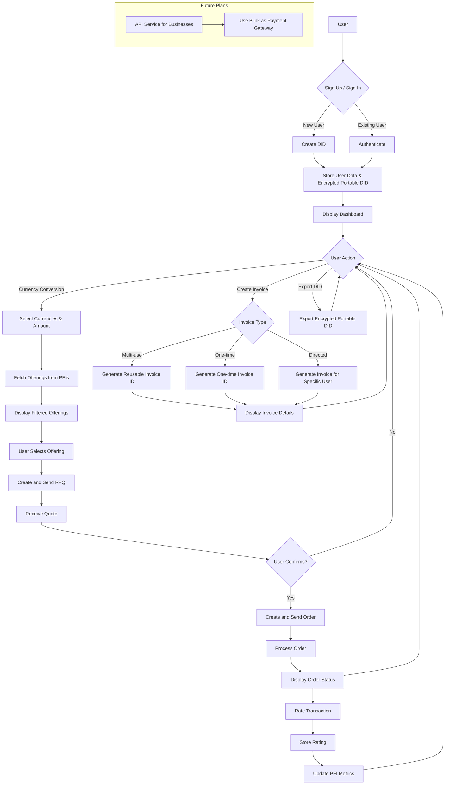

# Blink TBDex Wallet: Blink

## Overview
TBDex Wallet: Blink is a minimalist, user-friendly wallet application built on the tbDEX protocol, our web5 wallet application focuses on providing seamless currency conversion and fast cross-border payments, including the management of their business finace through invoice management.

## Key Features
1. Quick Sign Up / Sign In: Streamlined user onboarding with secure authentication and DID creation.
2. Blink: Instantly convert between fiat and cryptocurrencies using the best available rates from multiple Participating Financial Institutions (PFIs).
3. Smart Invoicing: Generate and share invoices for quick and easy payments, including multi-use invoices.
4. Business Integration: Foundation for businesses to use Blink as a payment gateway.
5. Multi-Currency Support: Create fiat accounts for local currencies and crypto addresses for easy receipt of payments.

## Application Flow Diagram

## Design Considerations

### Profitability
* Transaction Fees: We charge a small percentage fee on each conversion transaction.
* Premium Features: Future plans include offering premium features for power users and businesses.

### Optionality
* Our application aggregates offerings from multiple PFIs, presenting users with the best available rates.
* Users can view and compare different offerings before making a decision.

### Customer Management
* Decentralized Identifiers (DIDs) are created for each user during the sign-up process and store an encrypted portable version of thier new DID that can be exported and used on other applications that are built on the tbDEX protocol.
* Verifiable Credentials are obtained and securely stored, streamlining the KYC process for future transactions.

### Customer Satisfaction
* Users are prompted to rate transactions upon completion.
* We track and analyze satisfaction metrics to continually improve our service and PFI partnerships.

## Technical Stack
* Frontend: React with Material-UI
* Backend: Laravel (PHP)
* TBD Integration: @tbdex/http-client, @web5/dids

## Future Plans
* Expand business integration capabilities
* Implement advanced analytics for transaction data
* Enhance security features and compliance measures
* Create API services that can be consumed by other business allowing them use are our wallet as a payment option
* A more robus invoicing system to enable customers and business migrate management of their own clients when it comes to finance 

## License
This project is open source and available under the [MIT License](LICENSE).